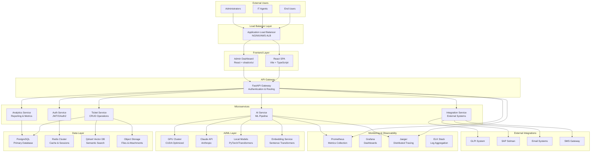
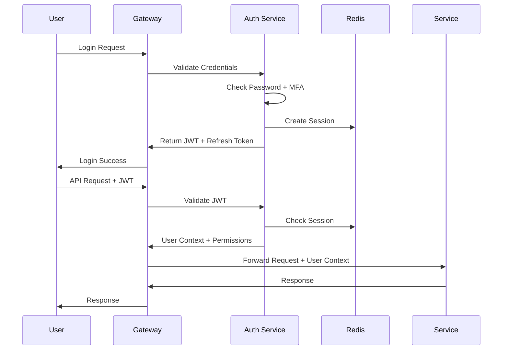
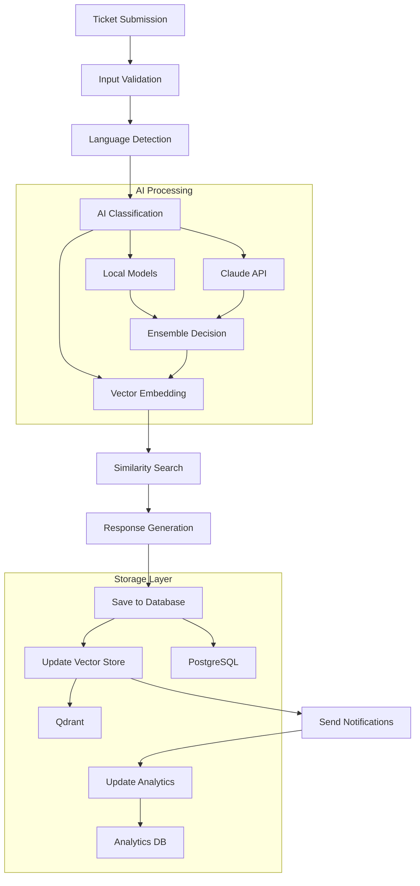
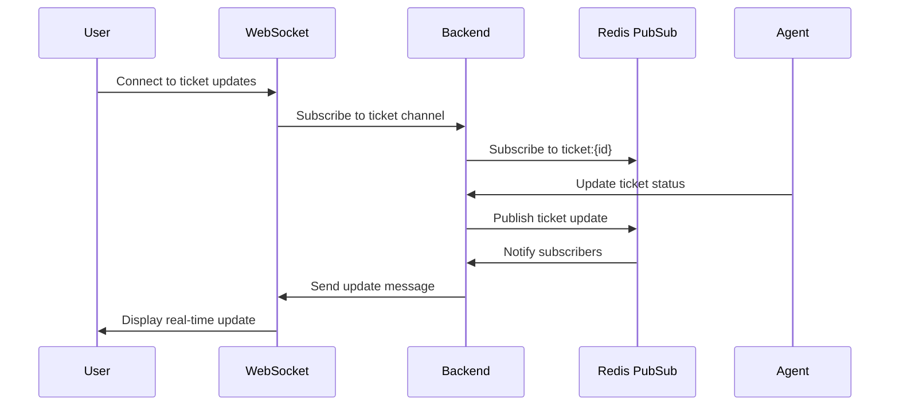

# OmniDesk AI - System Architecture

## Overview

OmniDesk AI is a production-ready, enterprise-grade IT ticket management system built on modern microservices architecture with advanced AI capabilities, comprehensive security, and cloud-native scalability.

## High-Level Architecture



## Component Architecture

### Frontend Layer

#### React SPA (Main Application)
- **Technology**: Vite + React 18 + TypeScript
- **UI Framework**: shadcn/ui with Radix primitives
- **Styling**: Tailwind CSS with design system
- **State Management**: React Query (TanStack Query)
- **Real-time**: WebSocket connection for live updates
- **Features**:
  - Responsive design for mobile/desktop
  - Progressive Web App (PWA) capabilities
  - Internationalization (i18n) support
  - Accessibility (WCAG 2.1 AA compliant)

#### Admin Dashboard
- **Technology**: React + TypeScript
- **Components**: Advanced data tables, charts, analytics
- **Authentication**: Role-based access control
- **Features**:
  - Real-time metrics visualization
  - User management interface  
  - System configuration panels
  - Audit log viewer

### API Gateway Layer

#### FastAPI Gateway
- **Technology**: FastAPI + Python 3.10+
- **Authentication**: JWT/OAuth2 with refresh tokens
- **Rate Limiting**: Redis-backed sliding window
- **Request Validation**: Pydantic v2 schemas
- **Features**:
  - Automatic OpenAPI documentation
  - Request/response logging
  - Correlation ID tracking
  - Circuit breaker patterns

### Microservices Layer

#### Authentication Service
```python
# Key Components
- JWT token management
- Role-based access control (RBAC)
- Session management with Redis
- Multi-factor authentication (MFA)
- Password policy enforcement
- OAuth2 provider integration

# Endpoints
POST /auth/login
POST /auth/refresh
POST /auth/logout  
GET  /auth/user
PUT  /auth/user/password
```

#### Ticket Service
```python
# Key Components
- CRUD operations for tickets
- Status workflow management
- File attachment handling
- Audit trail maintenance
- SLA tracking and alerts

# Endpoints  
POST   /tickets/
GET    /tickets/
GET    /tickets/{id}
PUT    /tickets/{id}
DELETE /tickets/{id}
POST   /tickets/{id}/responses
GET    /tickets/{id}/history
```

#### AI Service
```python
# Key Components
- GPU-accelerated ML models
- Multi-language processing
- Vector embedding generation
- Semantic similarity search
- Auto-response generation

# Endpoints
POST /ai/classify
POST /ai/generate-response  
POST /ai/search-similar
GET  /ai/models/status
POST /ai/embeddings/batch
```

### AI/ML Layer

#### GPU Acceleration
- **Hardware**: NVIDIA GPU with CUDA 11.8+
- **Optimization**: 
  - Model quantization (8-bit/16-bit)
  - Dynamic batching for optimal GPU utilization
  - Memory management with automatic cleanup
- **Models**:
  - Local Transformers (BERT, RoBERTa variants)
  - Sentence Transformers for embeddings
  - Custom fine-tuned models for classification

#### Claude API Integration
- **Provider**: Anthropic Claude
- **Models**: Claude-3.5-Sonnet for complex reasoning
- **Features**:
  - Context-aware classification
  - Multi-language response generation
  - Chain-of-thought reasoning
  - Fallback mechanisms for API failures

### Data Layer

#### PostgreSQL (Primary Database)
```sql
-- Key Tables
tickets (id, title, description, status, category, urgency, ...)
ticket_responses (id, ticket_id, response_text, is_ai_response, ...)
ticket_analytics (id, ticket_id, response_time, resolution_time, ...)
users (id, email, role, department, ...)
knowledge_base (id, title, content, category, tags, ...)

-- Performance Optimizations
- Partitioning by date for large tables
- Composite indexes for common queries
- Connection pooling (pgbouncer)
- Read replicas for analytics workloads
```

#### Redis Cluster
```redis
# Usage Patterns
sessions:{session_id} - User session data
rate_limit:{key} - Rate limiting counters  
cache:{key} - Application-level caching
queue:{name} - Background job queues
locks:{resource} - Distributed locks

# Configuration
- Cluster mode for high availability
- Persistence with AOF + RDB snapshots
- Memory optimization with compression
- Eviction policies for cache management
```

#### Qdrant Vector Database
```python
# Collections
omnidesk_tickets_v2 - Ticket embeddings (384D)
omnidesk_knowledge_v2 - Knowledge base embeddings
omnidesk_responses_v2 - Response embeddings

# Configuration  
- HNSW index for fast similarity search
- Cosine similarity distance metric
- Quantization for memory efficiency
- Horizontal scaling with sharding
```

## Security Architecture

### Authentication & Authorization



### Security Controls

#### Input Validation
- **Schema Validation**: Pydantic v2 models with comprehensive constraints
- **SQL Injection Prevention**: Parameterized queries with SQLAlchemy
- **XSS Prevention**: Content Security Policy (CSP) headers
- **CSRF Protection**: SameSite cookies and CSRF tokens

#### Rate Limiting
```python
# Implementation
- Sliding window algorithm with Redis
- Per-user and per-IP rate limits
- Exponential backoff for failed attempts
- Whitelist for trusted sources

# Limits
- API: 1000 req/min per user
- Auth: 5 attempts/min per IP  
- AI: 100 req/min per user
- File Upload: 10 files/min per user
```

#### Data Protection
- **Encryption at Rest**: AES-256 for database encryption
- **Encryption in Transit**: TLS 1.3 for all communications
- **Key Management**: HashiCorp Vault or AWS KMS
- **Data Masking**: PII redaction in logs and responses

## Scalability & Performance

### Horizontal Scaling

```yaml
# Kubernetes Deployment
apiVersion: apps/v1
kind: Deployment
metadata:
  name: omnidesk-backend
spec:
  replicas: 5
  template:
    spec:
      containers:
      - name: backend
        image: omnidesk/backend-gpu:latest
        resources:
          requests:
            memory: "2Gi"
            cpu: "1000m"
            nvidia.com/gpu: 1
          limits:
            memory: "4Gi" 
            cpu: "2000m"
            nvidia.com/gpu: 1
---
apiVersion: autoscaling/v2
kind: HorizontalPodAutoscaler
metadata:
  name: omnidesk-backend-hpa
spec:
  scaleTargetRef:
    apiVersion: apps/v1
    kind: Deployment
    name: omnidesk-backend
  minReplicas: 3
  maxReplicas: 20
  metrics:
  - type: Resource
    resource:
      name: cpu
      target:
        type: Utilization
        averageUtilization: 70
  - type: Pods
    pods:
      metric:
        name: ai_processing_queue_length
      target:
        type: AverageValue
        averageValue: "10"
```

### Performance Optimizations

#### Database Layer
- **Connection Pooling**: pgbouncer with 100-500 connections
- **Query Optimization**: Covering indexes, query plan analysis
- **Partitioning**: Time-based partitioning for large tables
- **Caching**: Redis for frequently accessed data

#### Application Layer  
- **Async Processing**: FastAPI with async/await patterns
- **Background Jobs**: Celery with Redis broker
- **Connection Pooling**: HTTP client connection reuse
- **Response Caching**: ETag and conditional requests

#### AI/ML Optimizations
- **Model Quantization**: 8-bit quantization for 50% memory reduction
- **Batch Processing**: Dynamic batching for GPU efficiency
- **Model Caching**: LRU cache for model outputs
- **Pipeline Parallelism**: Concurrent model execution

## Monitoring & Observability

### Metrics Collection

```python
# Prometheus Metrics
# HTTP Request Metrics
http_requests_total{method, endpoint, status_code}
http_request_duration_seconds{method, endpoint, status_code}

# AI Processing Metrics  
ai_processing_duration_seconds{operation, model, gpu_accelerated}
ai_confidence_score{operation, model}
ai_requests_total{operation, model, status}

# Business Metrics
tickets_created_total{category, urgency, source}
tickets_resolved_total{category, resolution_time_bucket}
sla_violations_total{category, violation_type}

# System Metrics
system_cpu_percent
system_memory_percent  
gpu_utilization_percent{gpu_id}
db_connections_active
```

### Distributed Tracing

```python  
# Jaeger Integration
from opentelemetry import trace
from opentelemetry.exporter.jaeger.thrift import JaegerExporter

# Trace ticket processing pipeline
@trace.get_tracer(__name__).start_as_current_span("process_ticket")
async def process_ticket(ticket_data):
    with trace.get_tracer(__name__).start_as_current_span("ai_classification"):
        classification = await classify_ticket(ticket_data)
    
    with trace.get_tracer(__name__).start_as_current_span("generate_response"):
        response = await generate_response(classification)
    
    with trace.get_tracer(__name__).start_as_current_span("save_ticket"):
        ticket_id = await save_ticket(ticket_data, classification, response)
    
    return ticket_id
```

### Logging Strategy

```python
# Structured Logging with Correlation IDs
import structlog

logger = structlog.get_logger(__name__)

# Example log entry
logger.info(
    "Ticket processed successfully",
    ticket_id="550e8400-e29b-41d4-a716-446655440000",
    user_id="user123",
    correlation_id="req_abc123",
    processing_time_ms=245.7,
    ai_confidence=0.92,
    category="Network",
    urgency="high"
)
```

## Deployment Architecture

### Container Strategy

```dockerfile
# Multi-stage build for optimization
FROM nvidia/cuda:11.8-devel-ubuntu22.04 as base
# ... base dependencies

FROM base as development  
# ... development tools + hot reload

FROM base as production
# ... production optimizations + security

FROM production as gpu-optimized
# ... GPU-specific optimizations
```

### Kubernetes Manifests

```yaml
# Namespace
apiVersion: v1
kind: Namespace
metadata:
  name: omnidesk-ai
  labels:
    app.kubernetes.io/name: omnidesk-ai

---
# ConfigMap for application configuration
apiVersion: v1  
kind: ConfigMap
metadata:
  name: omnidesk-config
  namespace: omnidesk-ai
data:
  environment: "production"
  log_level: "INFO"
  ai_model_cache_size: "10000"

---
# Secret for sensitive data
apiVersion: v1
kind: Secret
metadata:
  name: omnidesk-secrets
  namespace: omnidesk-ai
type: Opaque
data:
  database-url: <base64-encoded>
  anthropic-api-key: <base64-encoded>
  jwt-secret: <base64-encoded>
```

### Cloud Provider Specific

#### AWS EKS
```bash
# GPU Node Group
eksctl create nodegroup \
  --cluster=omnidesk-ai \
  --name=gpu-nodes \
  --node-type=g4dn.xlarge \
  --nodes=2 \
  --nodes-min=1 \
  --nodes-max=10 \
  --node-ami-family=AmazonLinux2 \
  --ssh-access \
  --ssh-public-key=my-key
```

#### Google Cloud GKE
```bash
# Create cluster with GPU support
gcloud container clusters create omnidesk-ai \
  --machine-type=n1-standard-4 \
  --num-nodes=3 \
  --enable-autoscaling \
  --min-nodes=1 \
  --max-nodes=10 \
  --accelerator=type=nvidia-tesla-t4,count=1
```

## Data Flow Architecture

### Ticket Processing Pipeline



### Real-time Communication



## Disaster Recovery

### Backup Strategy
- **Database**: Continuous WAL-E backup to S3
- **Vector Database**: Daily snapshots with version control
- **Application State**: Redis persistence with AOF + RDB
- **User Files**: S3 with cross-region replication

### High Availability
- **Database**: Primary/replica with automatic failover
- **Application**: Multi-zone deployment with load balancing
- **Cache**: Redis cluster with sentinel for failover
- **Monitoring**: Health checks with automatic recovery

### Recovery Procedures
1. **RTO (Recovery Time Objective)**: < 15 minutes
2. **RPO (Recovery Point Objective)**: < 5 minutes
3. **Automated Failover**: Health check failures trigger failover
4. **Manual Override**: Emergency procedures for manual intervention

## Compliance & Governance

### Data Governance
- **Data Classification**: Public, Internal, Confidential, Restricted
- **Retention Policies**: Automated data lifecycle management
- **Privacy Controls**: GDPR/CCPA compliance with data subject rights
- **Audit Trails**: Immutable logs for compliance reporting

### Security Compliance
- **SOC 2 Type II**: Controls for security, availability, confidentiality
- **ISO 27001**: Information security management system
- **GDPR**: Data protection and privacy requirements
- **HIPAA**: Healthcare data protection (if applicable)

This architecture provides a comprehensive foundation for a production-ready, enterprise-grade IT ticket management system with advanced AI capabilities, robust security, and cloud-native scalability.